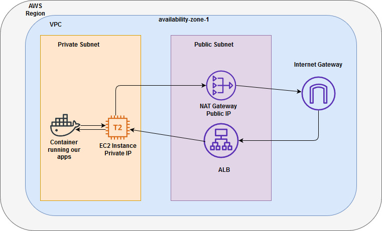
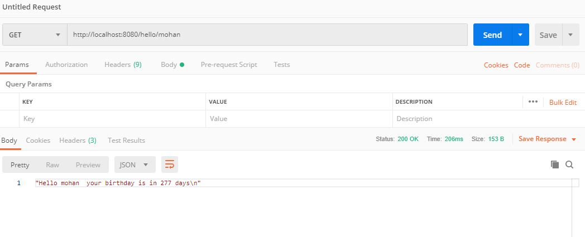

## Hello World Bday Applicationi

### This is a simple bday application in which you will get a response from app as N days remaining to your birthday or if it's your birthday today, Happy Birthady greeting message. 

## Overview

In this project I am trying to setup Jenkins pipeline for web application on top of Kubernetes cluster.

This is a simple 2-tier application where web application is running using Go and users are stored in backend database MySQL, respectively.

To locally run and test MySQL running into Docker container using the following command(using an official MySQL docker image), 

    $ docker container run --name mysqldb -v /opt/datadir:/var/lib/mysql -e MYSQL_ROOT_PASSWORD=root -d mysql:5.7

where, -v /opt/datadir:/var/lib/mysql telling that /opt/datadir which is on my host should be mapped to var/lib/mysql which is inside container. We do this so that we would have all MySQL created database files on our computer not just in docker container.

Grab the mysql IP and and use it in your go mysql driver while connecting to this database.

    $ docker container inspect mysqldb | grep IPAddr

And, for running go lang application I have use multi-stage docker image where we'll build go binary and copy it into tiny alpine docker image to run an application. 

    $ docker build -t simplebdayapp -f Dockerfile .

    $ docker container run -t simplebdayapp -p 8080:8080 SimpleBdayApp

Once docker images are ready we can push a docker image into [Docker Hub](https://hub.docker.com/) centralized repository for future reference and using this docker image.

Then simply running these docker containers into Kubernetes cluster using deployment and replica-sets. Once pods are running into K8s clsuter then create a service construct to access the applications running inside pod. The scaling of application will be based on resource utilization, CPU, memory of containers inside pod and once it reach 80%, it we'll do horizontal pod autoscaling and our application will scale-up and vice-versa for scale-down the desired set of replicas running inside cluster.

From SRE prespective, I need to look at following factors and make sure my application is reliable at all time.

`Security`: As it's a vital in every project, I'll need to make sure that no applications are exposed to outside network except my application port. Along with weekly security vulnerability scanning on my application. Whenever services scale-up, need to check for rate-limiting and other best practices of distributed system.

`Reliability`: 

`Performance Efficiency`: All the requests are served within a certain time. There should be performance test apply on services per need basic or scheduled and once new features are added, it will run and metrice are in a normal range.

`Cost optimization`: Wherever necessary and possible must need to apply resource(hardware) and operational optimization which will results into cost optimization.

`Operational excellence`: Automation should be in place and whenever addig any new feature, it should go though automation which will be quick and perfect. In any failure case, the rollback will be easy. Monitoring the applications, log management and respective Infrastructure as a Code should be in place to achieve operational excellence. Along, disaster recovery plans should be ready in case of anything happen to the applications or infrastructure.
